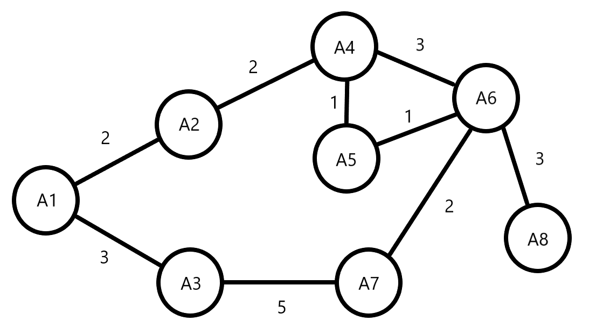

# Graph_JS

Implementation of a graph in JavaScript.

The Dijkstra algorithm is also implemented for minimal cost route between two vertices.

The project contains 2 auxiliary classes (Queue and Vertice).

- The Queue class is used during the Dijkstra algorithm execution;
- The Vertice class is used to build the Graph class.

An example is provided in folder [examples](./examples). The example have it's descriptive image in the [imgs](./imgs) folder.

For example1, the following graph is created and Dijkstra algorithm must find the minimal cost between vertices A1 and A8:

The expected output for example1 is:

_Minimal cost: 9_
